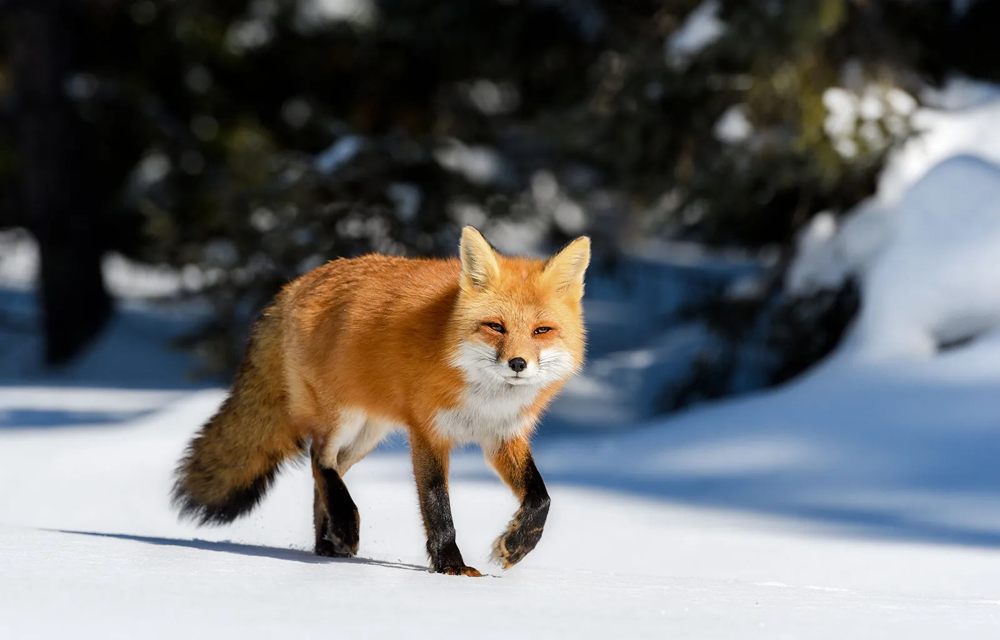
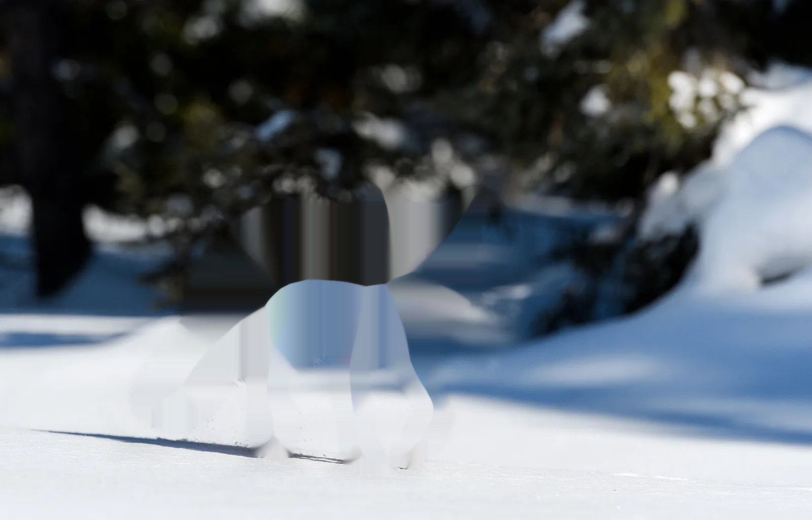
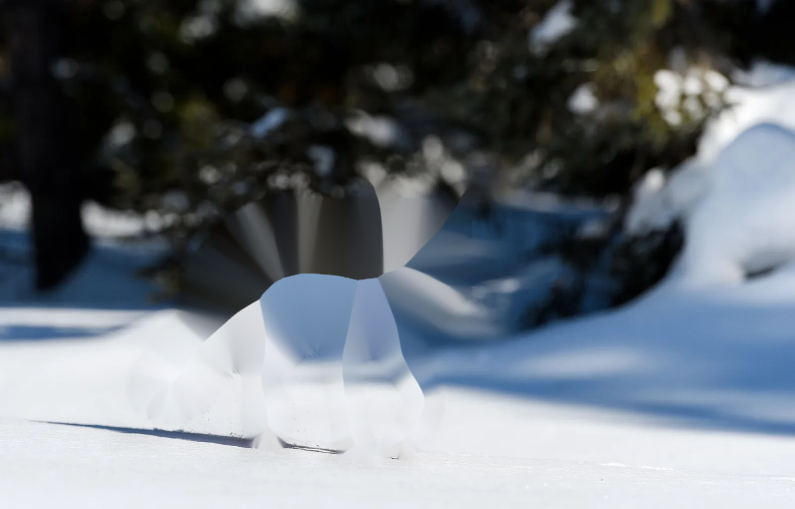
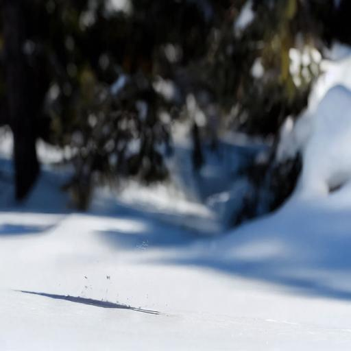

# Object Removal Using OpenCV & Stable Diffusion

## Overview
This project explores different methods for object removal from images using both traditional computer vision techniques and deep learning-based inpainting. The methods evaluated include:

- **OpenCV Inpainting (INPAINT_NS & INPAINT_TELEA)**: Traditional image inpainting algorithms.
- **Auto-Masking with OpenCV**: Automatically generating a mask for object removal.
- **Stable Diffusion Inpainting**: A deep learning-based method for realistic object removal.

## Methods & Comparison
Each method has been tested and evaluated based on accuracy, speed, and computational requirements:

| Method                      | Accuracy | Speed | Computational Cost | Suitability |
|-----------------------------|----------|--------|---------------------|-------------|
| **INPAINT_NS (OpenCV)**     | Low      | Fast   | Low                 | Minor object removal |
| **INPAINT_TELEA (OpenCV)**  | Low      | Fast   | Low                 | Small defect correction |
| **Auto Masking + OpenCV**   | Very Low | Medium | Low                 | Poor due to inaccurate mask |
| **Stable Diffusion Inpainting** | High     | Slow   | High (GPU required) | Best for complex removals |

## Installation
To run this project, make sure you have the required dependencies installed.

### **1. Clone the Repository**
```bash
git clone https://github.com/yourusername/object-removal.git
cd object-removal
```

### **2. Create a Virtual Environment (Optional but Recommended)**
```bash
python -m venv venv
source venv/bin/activate  # On Windows: venv\Scripts\activate
```

### **3. Install Dependencies**
```bash
pip install -r requirements.txt
```


## Example Results
### **Original Image**


### **INPAINT_NS Result**


### **INPAINT_TELEA Result**


### **Stable Diffusion Inpainting Result**


## Conclusion
- **OpenCV-based methods** are fast but struggle with large missing areas.
- **Stable Diffusion** provides superior results but is computationally expensive.

## References
- OpenCV Documentation: [https://docs.opencv.org/](https://docs.opencv.org/)
- Stable Diffusion Inpainting: [https://huggingface.co/stabilityai](https://huggingface.co/stabilityai)

## License
This project is licensed under the MIT License - see the [LICENSE](LICENSE) file for details.
